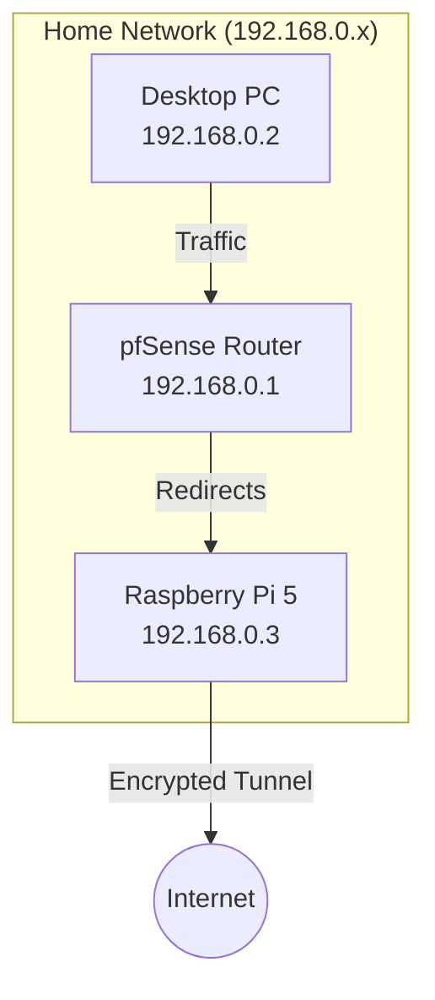

---

# Mullvad VPN Hardened Gateway (DAITA + Quantum + QUIC) on Raspberry Pi 5

## 📖 Project Overview

I architected a solution where my **pfSense router** handles standard edge security but offloads VPN duties to a downstream **Raspberry Pi 5**. This is necessary because pfSense does not natively support Mullvad's newest **DAITA** (traffic pattern masking), **Quantum-Resistant** encryption, and **QUIC** obfuscation protocols.

The Pi acts as a hardened gateway, wrapping all traffic in these advanced layers. These heavy features originally caused interface crashes due to high handshake latency. To stabilize this, I engineered a custom bash script that enforces a "cold boot" service restart to ensure a clean bind and applies **CAKE** traffic shaping to sustain reliable **500Mbps** performance.

## 🗺️ Network Layout

This diagram shows how devices connect physically and logically. The Desktop sends data to the pfSense router, which redirects it to the Pi 5. The Pi encrypts it and sends it out to the internet.



## ⚙️ Prerequisites

* **Hardware:** Raspberry Pi 5 (recommended for AES performance, 4GB RAM preferred) or Pi 4.
* **OS:** Raspberry Pi OS Lite (64-bit).
* **Network:** Ethernet connection to your pfSense LAN.
* **Account:** A valid Mullvad VPN account number.

---

## 🚀 Step 1: Raspberry Pi 5 Setup

### 1. Install Dependencies & Mullvad

SSH into your Raspberry Pi (`192.168.0.3`) and run:

```bash
# Update System
sudo apt update && sudo apt full-upgrade -y

# Install Mullvad VPN App
sudo curl -fsSLo /usr/share/keyrings/mullvad-keyring.asc https://repository.mullvad.net/deb/mullvad-keyring.asc
echo "deb [signed-by=/usr/share/keyrings/mullvad-keyring.asc arch=$( dpkg --print-architecture )] https://repository.mullvad.net/deb/stable $(lsb_release -cs) main" | sudo tee /etc/apt/sources.list.d/mullvad.list
sudo apt update
sudo apt install mullvad-vpn -y

# Login
mullvad account login <YOUR_ACCOUNT_NUMBER>

```

### 2. Install the Hardened Gateway Script

Create the automation script that handles the "Cold Boot" logic and traffic shaping.

`sudo nano /usr/local/bin/mullvad-gateway.sh`

Paste the following code (v17.1 Stable):

```bash
#!/bin/bash
# ==============================================================================
#  MULLVAD HARDENED GATEWAY (v17.1)
#  - Features: DAITA + QUANTUM + QUIC (All Enabled)
#  - Fix: "Cold Boot" Restart Strategy to prevent handshake crashes
#  - Perf: CAKE QoS @ 500Mbit + MSS Clamping
# ==============================================================================

# 1. CLEANUP & PREP
pkill -f "mullvad_watchdog_process"
pkill -f "ping -c 1"
iptables -F
iptables -P FORWARD ACCEPT
echo "[$(date)] 🟢 Starting Gateway Sequence..."

# 2. OPTIMIZE NETWORK
ethtool --set-eee eth0 eee off > /dev/null 2>&1 || true
sysctl -w net.ipv4.ip_forward=1 > /dev/null

# 3. CONFIGURE MULLVAD
mullvad disconnect
# Enable Obfuscation (QUIC)
mullvad obfuscation set mode quic
mullvad relay set tunnel-protocol wireguard
mullvad relay set location nl
# Enable Advanced Security
mullvad tunnel set wireguard --quantum-resistant on
mullvad tunnel set wireguard --daita on
mullvad lan set allow

# 4. COLD BOOT (CRITICAL FIX)
# Restarts daemon to force a clean bind for heavy encryption layers
echo "🔄 Restarting Mullvad Service..."
systemctl restart mullvad-daemon
sleep 10

# 5. CONNECT & WAIT
echo "⏳ Connecting..."
mullvad connect

MAX_RETRIES=45
COUNT=0
NEW_WG_IF=""
while [ $COUNT -lt $MAX_RETRIES ]; do
    NEW_WG_IF=$(ip -br link show | grep -E 'wg[0-9]?-mullvad' | awk '{print $1}')
    if [ -n "$NEW_WG_IF" ]; then
        echo "✅ Interface Created: $NEW_WG_IF"
        break
    fi
    sleep 1
    ((COUNT++))
done

if [ -z "$NEW_WG_IF" ]; then
    echo "❌ CRITICAL: Handshake failed. Reverting to safe mode..."
    mullvad tunnel set wireguard --daita off
    mullvad connect
    exit 1
fi

# 6. ROUTING & FIREWALL
ip link set dev "$NEW_WG_IF" mtu 1280
iptables -t nat -A POSTROUTING -o "$NEW_WG_IF" -j MASQUERADE
iptables -t mangle -A FORWARD -p tcp --tcp-flags SYN,RST SYN -j TCPMSS --set-mss 1000

# 7. TRAFFIC CONTROL (CAKE - 500Mbit)
tc qdisc del dev eth0 root > /dev/null 2>&1
tc qdisc add dev eth0 root cake bandwidth 500mbit nat wash ack-filter

# 8. VERIFICATION
echo "⏳ Waiting for connectivity..."
sleep 5
STATUS=$(mullvad status | head -n 1)
IP=$(curl -s --connect-timeout 5 https://am.i.mullvad.net/ip || echo "Unknown")

echo "================ STATUS REPORT ================"
echo "STATUS:      $STATUS"
echo "PUBLIC IP:   $IP"
echo "OBFUSCATION: $(mullvad obfuscation get | awk '{print $2}')"
echo "DAITA/PQC:   Active"
echo "==============================================="

```

### 3. Make it Executable & Run

```bash
sudo chmod +x /usr/local/bin/mullvad-gateway.sh
sudo bash /usr/local/bin/mullvad-gateway.sh

```

---

## 🛡️ Step 2: pfSense Router Settings

Since pfSense cannot handle these encryption protocols natively, we will route your Desktop's traffic **through** the Pi.

**Network Map:**

* **pfSense Router:** `192.168.0.1`
* **Desktop PC:** `192.168.0.2`
* **Raspberry Pi 5:** `192.168.0.3`

### 1. Set a Static IP for the Pi

* Go to **Services > DHCP Server**.
* Find your Raspberry Pi's MAC address.
* Assign it the Static IP: `192.168.0.3`.

### 2. Create the Gateway

* Go to **System > Routing > Gateways**.
* Click **Add**.
* **Interface:** LAN
* **Address Family:** IPv4
* **Name:** `PI_VPN_GW`
* **Gateway:** `192.168.0.3` (The Pi's IP)
* **Monitor IP:** `1.1.1.1` (To check if the VPN is up)


* Click **Save** and **Apply**.

### 3. Route Traffic to the Pi

* Go to **Firewall > Rules > LAN**.
* Click **Add** (Top of the list).
* **Action:** Pass
* **Protocol:** Any
* **Source:** Single Host or Alias -> `192.168.0.2` (Your Desktop IP).
* **Destination:** Any
* **Advanced Options (Show Advanced):** Scroll down to **Gateway**.
* **Gateway:** Select `PI_VPN_GW`.


* Click **Save** and **Apply**.

**Result:** Your Desktop (`192.168.0.2`) will now bypass the standard WAN and be forced through the Raspberry Pi (`192.168.0.3`) -> Mullvad Tunnel -> Internet.

---

## ✅ Verification

On the Raspberry Pi (`192.168.0.3`), you can monitor the connection logs:

```bash
tail -f /var/log/mullvad-optimizer.log

```

Expected Output:

```text
✅ Interface Created: wg0-mullvad
✅ Connection Established!
PUBLIC IP: 185.x.x.x
Obfuscation: quic (QUIC)

```

On your Desktop (`192.168.0.2`), visit [https://mullvad.net/check](https://mullvad.net/check). It should show:

* **Secure:** Yes
* **Server:** Mullvad (Netherlands)
* **Quantum Resistant:** Yes
