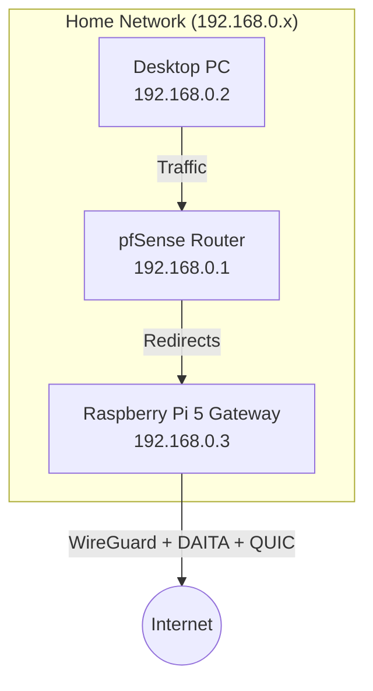

# Mullvad Hardened Gateway (DAITA + Quantum + QUIC) on Raspberry Pi 5

## 📖 Project Overview

I architected a solution where my **pfSense router** handles standard edge security but offloads VPN duties to a downstream **Raspberry Pi 5**. This is necessary because pfSense does not natively support Mullvad's newest **DAITA** (traffic pattern masking), **Quantum-Resistant** encryption, and **QUIC** obfuscation protocols.

The Pi acts as a hardened gateway, wrapping all traffic in these advanced layers. These heavy features originally caused interface crashes due to high handshake latency. To stabilize this, I engineered a custom bash script that enforces a "cold boot" service restart to ensure a clean bind and applies **CAKE** traffic shaping to sustain reliable **500Mbps** performance.

The result is a **self-healing network**: the system automatically detects connection drops, packet loss, or timeouts and seamlessly migrates routes to a healthy relay without any manual intervention.

### 🏆 Real-World Results

The results are impressive.

* **Speed:** Achieved **~300Mbps** downstream (server dependent) with **500Mbps** queue capacity.
* **Efficiency:** Raspberry Pi 5 CPU load stabilizes at only **~51%** under heavy load.
* **Stability:** This solution is significantly more stable than running OpenVPN or WireGuard directly on pfSense. The Mullvad daemon handles packet loss or timeouts by automatically migrating routes to a healthy relay.

## 🗺️ Network Layout


```mermaid
graph TD
    Internet((Internet))
    
    subgraph "Home Network (192.168.0.x)"
        Router[pfSense Router <br/> 192.168.0.1]
        Pi[Raspberry Pi 5 Gateway <br/> 192.168.0.3]
        PC[Desktop PC <br/> 192.168.0.2]
    end

    PC -->|Traffic| Router
    Router -->|Redirects| Pi
    Pi -->|WireGuard + DAITA + QUIC| Internet

```

## ⚙️ Prerequisites

* **Hardware:** Raspberry Pi 5 (Preferred for Quantum performance; 4GB RAM recommended) or Pi 4.
* **OS:** Raspberry Pi OS Lite (64-bit).
* **Network:** Ethernet connection to your pfSense LAN.
* **Account:** A valid Mullvad VPN account number.

---

## 🚀 Step 1: Raspberry Pi 5 Setup

### 1. Install Dependencies & Mullvad

SSH into your Raspberry Pi (`192.168.0.3`) and run:

```bash
# Update System
sudo apt update && sudo apt full-upgrade -y

# Install Mullvad VPN App
sudo curl -fsSLo /usr/share/keyrings/mullvad-keyring.asc https://repository.mullvad.net/deb/mullvad-keyring.asc
echo "deb [signed-by=/usr/share/keyrings/mullvad-keyring.asc arch=$( dpkg --print-architecture )] https://repository.mullvad.net/deb/stable $(lsb_release -cs) main" | sudo tee /etc/apt/sources.list.d/mullvad.list
sudo apt update
sudo apt install mullvad-vpn -y

# Login
mullvad account login <YOUR_ACCOUNT_NUMBER>

```

### 2. Install the Hardened Gateway Script

This script handles the "Cold Boot" logic, enables the security stack (DAITA/QUIC/Quantum), and applies CAKE traffic shaping.

`sudo nano /usr/local/bin/mullvad-gateway.sh`

**Paste the following code (v23.1 Stable):**

```bash
#!/bin/bash
# ==============================================================================
#   MULLVAD DAITA ENFORCED GATEWAY (v23.1)
#   Tested: Mullvad 2026.1 / Debian 13 (Trixie) / Proxmox VM / Pi 5 4GB Ram
#
#   Just run: sudo bash install-mullvad-gateway.sh
# ==============================================================================

# --- CONFIG ---
if [ -z "${LAN_IF:-}" ]; then
    LAN_IF=$(ip route show default 2>/dev/null | awk '{print $5; exit}')
    [ -z "$LAN_IF" ] && LAN_IF="eth0"
fi

ALLOWED_COUNTRIES=("nl" "ch" "us" "de" "se")
BAN_FILE="/var/log/mullvad_banlist.log"
LAST_USED_FILE="/var/tmp/mullvad_last_gw"
LOG_FILE="/var/log/mullvad-optimizer.log"
CAKE_BW="500mbit"
MSS_CLAMP=1220

# --- PRE-FLIGHT ---
echo ""
echo "============================================================"
echo "  MULLVAD GATEWAY v23.1"
echo "============================================================"

[ "$(id -u)" -ne 0 ] && { echo "FAIL: Must run as root"; exit 1; }

for pkg in curl iptables conntrack; do
    command -v "$pkg" &>/dev/null || { echo "Installing $pkg..."; apt-get install -y "$pkg" > /dev/null 2>&1; }
done

if ! command -v mullvad &>/dev/null; then
    echo "Mullvad not found. Installing..."
    curl -fsSLo /usr/share/keyrings/mullvad-keyring.asc https://repository.mullvad.net/deb/mullvad-keyring.asc
    echo "deb [signed-by=/usr/share/keyrings/mullvad-keyring.asc arch=$(dpkg --print-architecture)] https://repository.mullvad.net/deb/stable stable main" | tee /etc/apt/sources.list.d/mullvad.list > /dev/null
    apt-get update > /dev/null 2>&1
    apt-get install -y mullvad-vpn
    if ! command -v mullvad &>/dev/null; then
        echo "FAIL: Mullvad install failed"
        exit 1
    fi
    echo "PASS: Mullvad installed"
    sleep 5
fi

if ! ip link show "$LAN_IF" &>/dev/null; then
    echo "FAIL: Interface '$LAN_IF' not found"
    ip -br link show | grep -v lo
    echo "  Override: LAN_IF=ens18 sudo bash install-mullvad-gateway.sh"
    exit 1
fi
echo "PASS: Interface: $LAN_IF"

TOTAL_RAM_MB=$(awk '/MemTotal/ {printf "%d", $2/1024}' /proc/meminfo)
[ "$TOTAL_RAM_MB" -lt 1500 ] && echo "WARN: ${TOTAL_RAM_MB}MB RAM — DAITA may OOM"

# --- LOGIN CHECK ---
systemctl start mullvad-daemon 2>/dev/null || true

# Wait for daemon to be fully ready
echo -n "Waiting for daemon"
TRIES=0
while [ $TRIES -lt 20 ]; do
    mullvad status &>/dev/null && break
    echo -n "."
    sleep 1
    TRIES=$((TRIES + 1))
done
echo ""

# Unblock network before any checks
mullvad disconnect 2>/dev/null || true
sleep 2

# Check login — mullvad account get exit code is unreliable on 2026.1
# Use THREE methods: device file, account get output, and status output
LOGGED_IN=false

# Method 1: Device file exists (most reliable — daemon stores this on login)
[ -f /etc/mullvad-vpn/device.json ] && LOGGED_IN=true

# Method 2: account get output contains digits (account number)
if ! $LOGGED_IN; then
    ACCT_OUT=$(mullvad account get 2>&1 || true)
    echo "$ACCT_OUT" | grep -qE '[0-9]{4}' && LOGGED_IN=true
fi

# Method 3: status doesn't say "not logged" or "no account"
if ! $LOGGED_IN; then
    STATUS_OUT=$(mullvad status 2>&1 || true)
    if ! echo "$STATUS_OUT" | grep -qi "not logged"; then
        echo "$STATUS_OUT" | grep -qiE "Disconnected|Connected" && LOGGED_IN=true
    fi
fi

if $LOGGED_IN; then
    echo "PASS: Mullvad account"
else
    echo ""
    echo "============================================================"
    echo "  NOT LOGGED IN"
    echo ""
    echo "  Step 1: Run this command with your account number:"
    echo ""
    echo "    mullvad account login YOUR_ACCOUNT_NUMBER"
    echo ""
    echo "  Step 2: Re-run the gateway script:"
    echo ""
    echo "    sudo bash install-mullvad-gateway.sh"
    echo ""
    echo "============================================================"
    exit 1
fi
echo "PASS: All checks passed"

# --- SSH SAFETY ---
restore_ssh() {
    iptables -P INPUT ACCEPT 2>/dev/null
    iptables -P FORWARD ACCEPT 2>/dev/null
    iptables -F 2>/dev/null
}
trap restore_ssh ERR

# --- LOGGING ---
touch "$LOG_FILE"
exec > >(tee -a "$LOG_FILE") 2>&1
echo ""
echo "[$(date)] Starting Gateway..."

# --- HELPERS ---
clean_ban_list() {
    [ -f "$BAN_FILE" ] || return
    local NOW; NOW=$(date +%s)
    awk -v expiry="$((NOW - 28800))" '$1 > expiry' "$BAN_FILE" > "${BAN_FILE}.tmp" && mv "${BAN_FILE}.tmp" "$BAN_FILE"
}

get_valid_country() {
    clean_ban_list
    local AVAILABLE=()
    for c in "${ALLOWED_COUNTRIES[@]}"; do
        grep -q " $c$" "$BAN_FILE" 2>/dev/null || AVAILABLE+=("$c")
    done
    [ ${#AVAILABLE[@]} -eq 0 ] && { true > "$BAN_FILE"; AVAILABLE=("${ALLOWED_COUNTRIES[@]}"); }
    local LAST=""; [ -f "$LAST_USED_FILE" ] && LAST=$(cat "$LAST_USED_FILE")
    local CANDS=()
    for c in "${AVAILABLE[@]}"; do [ "$c" != "$LAST" ] && CANDS+=("$c"); done
    [ ${#CANDS[@]} -eq 0 ] && CANDS=("${AVAILABLE[@]}")
    local SEL=${CANDS[$((RANDOM % ${#CANDS[@]}))]}
    echo "$SEL" > "$LAST_USED_FILE"
    echo "$SEL"
}

set_features() {
    mullvad anti-censorship set mode quic 2>/dev/null \
        || mullvad anti-censorship set protocol quic 2>/dev/null \
        || mullvad obfuscation set mode quic 2>/dev/null \
        || echo "  WARN: QUIC not set"

    mullvad tunnel wireguard quantum-resistant on 2>/dev/null \
        || mullvad tunnel set quantum-resistant on 2>/dev/null || true

    mullvad tunnel wireguard daita on 2>/dev/null \
        || mullvad tunnel set daita on 2>/dev/null || true

    mullvad lan set allow 2>/dev/null || true
}

# --- FIREWALL LOCKDOWN ---
pkill -f "mullvad_watchdog_v23" 2>/dev/null || true

iptables -P FORWARD DROP
iptables -P INPUT DROP
iptables -P OUTPUT ACCEPT
iptables -F
iptables -t nat -F
iptables -t mangle -F
iptables -A INPUT -i lo -j ACCEPT
iptables -A INPUT -m state --state ESTABLISHED,RELATED -j ACCEPT
iptables -A FORWARD -m state --state ESTABLISHED,RELATED -j ACCEPT
iptables -A INPUT -i "$LAN_IF" -p tcp --dport 22 -j ACCEPT
iptables -A INPUT -i "$LAN_IF" -p icmp -j ACCEPT

ethtool --set-eee "$LAN_IF" eee off 2>/dev/null || true
sysctl -w net.ipv4.ip_forward=1 > /dev/null
sysctl -w net.ipv6.conf.all.disable_ipv6=1 2>/dev/null
sysctl -w net.ipv6.conf.default.disable_ipv6=1 2>/dev/null

echo "[$(date)] Firewall locked (FORWARD=DROP)"

# --- CONNECT ---
# NO daemon restart — that's what kills the login session
connect_mullvad() {
    local CC=$1
    echo "[$(date)] Connecting to ${CC^^}..."

    mullvad disconnect 2>/dev/null || true
    sleep 2

    # Ensure daemon is running (start, not restart)
    if ! systemctl is-active --quiet mullvad-daemon; then
        systemctl start mullvad-daemon
        sleep 5
    fi

    # Configure
    mullvad relay set location "$CC"
    set_features

    # Connect and capture output
    CONNECT_OUT=$(mullvad connect 2>&1)

    # CHECK: If not logged in, stop immediately with clear instructions
    if echo "$CONNECT_OUT" | grep -qi "not logged in"; then
        echo ""
        echo "============================================================"
        echo "  NOT LOGGED IN"
        echo ""
        echo "  The daemon lost your login session."
        echo "  Run these commands:"
        echo ""
        echo "    mullvad disconnect"
        echo "    mullvad account login YOUR_ACCOUNT_NUMBER"
        echo "    sudo bash install-mullvad-gateway.sh"
        echo ""
        echo "============================================================"
        restore_ssh
        exit 1
    fi

    # Wait for interface
    local MAX=45 COUNT=0 WG_IF=""
    while [ $COUNT -lt $MAX ]; do
        WG_IF=$(ip -br link show | grep -oE 'wg[0-9]?-mullvad' | head -1)
        if [ -n "$WG_IF" ]; then
            echo "[$(date)] Interface: $WG_IF"
            echo "$WG_IF" > /var/tmp/mullvad_current_if
            break
        fi
        sleep 1
        COUNT=$((COUNT + 1))
    done
    [ -z "$WG_IF" ] && return 1

    # Tunnel rules
    ip link set dev "$WG_IF" mtu 1280
    iptables -A FORWARD -i "$LAN_IF" -o "$WG_IF" -j ACCEPT
    iptables -t nat -A POSTROUTING -o "$WG_IF" -j MASQUERADE
    iptables -t mangle -A FORWARD -p tcp --tcp-flags SYN,RST SYN -j TCPMSS --set-mss $MSS_CLAMP
    iptables -A FORWARD -i "$LAN_IF" -o "$LAN_IF" -p udp --dport 53 -j DROP
    iptables -A FORWARD -i "$LAN_IF" -o "$LAN_IF" -p tcp --dport 53 -j DROP
    modprobe sch_cake 2>/dev/null || true
    tc qdisc del dev "$LAN_IF" root 2>/dev/null || true
    tc qdisc add dev "$LAN_IF" root cake bandwidth $CAKE_BW nat wash ack-filter 2>/dev/null || true
    return 0
}

TARGET=$(get_valid_country)
echo "[$(date)] Target: ${TARGET^^}"

if ! connect_mullvad "$TARGET"; then
    echo "[$(date)] Retrying without DAITA..."
    mullvad tunnel wireguard daita off 2>/dev/null || mullvad tunnel set daita off 2>/dev/null || true
    if ! connect_mullvad "$TARGET"; then
        echo "[$(date)] CRITICAL: Could not establish tunnel."
        exit 1
    fi
fi

# --- VERIFY ---
echo "[$(date)] Waiting for connection..."
MAX_WAIT=20
WAIT_COUNT=0
while [ $WAIT_COUNT -lt $MAX_WAIT ]; do
    STATUS=$(mullvad status 2>/dev/null | head -n 1)
    [[ "$STATUS" == *"Connected"* ]] && break
    sleep 1
    WAIT_COUNT=$((WAIT_COUNT + 1))
done

WG_IF=$(cat /var/tmp/mullvad_current_if 2>/dev/null || echo "?")
IP=$(curl -s --connect-timeout 5 https://am.i.mullvad.net/ip || echo "Unknown")
FULL_STATUS=$(mullvad status 2>/dev/null)

OBF="none"
echo "$FULL_STATUS" | grep -qi "quic" && OBF="quic"
echo "$FULL_STATUS" | grep -qi "shadowsocks" && OBF="shadowsocks"
echo "$FULL_STATUS" | grep -qi "udp2tcp" && OBF="udp2tcp"
echo "$FULL_STATUS" | grep -qi "lwo" && OBF="lwo"
[ "$OBF" = "none" ] && {
    OBF=$(mullvad anti-censorship show 2>/dev/null | grep -ioE 'quic|shadowsocks|udp2tcp|lwo' | head -1)
    [ -z "$OBF" ] && OBF="none"
}

MULTIHOP="off"; echo "$FULL_STATUS" | grep -qi "multihop\|via" && MULTIHOP="on"
DAITA_ST="off"; echo "$FULL_STATUS" | grep -qi "daita" && DAITA_ST="on"
QUANTUM_ST="off"; echo "$FULL_STATUS" | grep -qi "quantum" && QUANTUM_ST="on"

echo ""
echo "================ STATUS REPORT ================"
echo "STATUS:      $STATUS"
echo "PUBLIC IP:   $IP"
echo "INTERFACE:   $WG_IF"
echo "OBFUSCATION: $OBF"
echo "QUANTUM:     $QUANTUM_ST"
echo "DAITA:       $DAITA_ST"
echo "MULTIHOP:    $MULTIHOP"
echo "MSS CLAMP:   $MSS_CLAMP"
echo "QUEUE ALG:   CAKE ($CAKE_BW)"
echo "FWD POLICY:  DROP (tunnel-only)"
echo "==============================================="

# --- WATCHDOG ---
(
exec -a mullvad_watchdog_v23 bash -c '
LAN_IF="'"$LAN_IF"'"
MSS_CLAMP='"$MSS_CLAMP"'
CAKE_BW="'"$CAKE_BW"'"
ALLOWED_COUNTRIES=('"$(printf '"%s" ' "${ALLOWED_COUNTRIES[@]}")"')
BAN_FILE="'"$BAN_FILE"'"
LAST_USED_FILE="'"$LAST_USED_FILE"'"
LOG_FILE="'"$LOG_FILE"'"

FAIL_COUNT=0
THRESHOLD=3
CURRENT_IF=$(cat /var/tmp/mullvad_current_if 2>/dev/null || echo "")
CURRENT_COUNTRY=$(cat "$LAST_USED_FILE" 2>/dev/null || echo "")

echo "[$(date)] Watchdog v23 active. IF=$CURRENT_IF" >> "$LOG_FILE"

while true; do
    sleep 10
    HEALTHY=true
    mullvad status 2>/dev/null | grep -q "Connected" || HEALTHY=false
    $HEALTHY && ! ping -c 1 -W 3 1.1.1.1 > /dev/null 2>&1 && HEALTHY=false

    if ! $HEALTHY; then
        FAIL_COUNT=$((FAIL_COUNT + 1))
        echo "[$(date)] Health fail ($FAIL_COUNT/$THRESHOLD)" >> "$LOG_FILE"

        if [ $FAIL_COUNT -ge $THRESHOLD ]; then
            [ -n "$CURRENT_COUNTRY" ] && echo "$(date +%s) $CURRENT_COUNTRY" >> "$BAN_FILE"

            if [ -n "$CURRENT_IF" ]; then
                iptables -D FORWARD -i "$LAN_IF" -o "$CURRENT_IF" -j ACCEPT 2>/dev/null || true
                iptables -t nat -D POSTROUTING -o "$CURRENT_IF" -j MASQUERADE 2>/dev/null || true
                conntrack -F 2>/dev/null || true
            fi

            NOW=$(date +%s); EXPIRY=$((NOW - 28800))
            [ -f "$BAN_FILE" ] && {
                awk -v expiry="$EXPIRY" "\$1 > expiry" "$BAN_FILE" > "${BAN_FILE}.tmp"
                mv "${BAN_FILE}.tmp" "$BAN_FILE"
            }
            AVAILABLE=()
            for c in "${ALLOWED_COUNTRIES[@]}"; do
                grep -q " $c$" "$BAN_FILE" 2>/dev/null || AVAILABLE+=("$c")
            done
            [ ${#AVAILABLE[@]} -eq 0 ] && { true > "$BAN_FILE"; AVAILABLE=("${ALLOWED_COUNTRIES[@]}"); }
            NEW_COUNTRY=${AVAILABLE[$((RANDOM % ${#AVAILABLE[@]}))]}

            echo "[$(date)] Switching to ${NEW_COUNTRY^^}" >> "$LOG_FILE"

            mullvad disconnect 2>/dev/null || true
            mullvad relay set location "$NEW_COUNTRY"
            mullvad anti-censorship set mode quic 2>/dev/null || mullvad obfuscation set mode quic 2>/dev/null || true
            mullvad tunnel wireguard quantum-resistant on 2>/dev/null || mullvad tunnel set quantum-resistant on 2>/dev/null || true
            mullvad tunnel wireguard daita on 2>/dev/null || mullvad tunnel set daita on 2>/dev/null || true
            mullvad connect
            sleep 12

            NEW_IF=$(ip -br link show | grep -oE "wg[0-9]?-mullvad" | head -1)
            if [ -n "$NEW_IF" ]; then
                ip link set dev "$NEW_IF" mtu 1280
                iptables -A FORWARD -i "$LAN_IF" -o "$NEW_IF" -j ACCEPT
                iptables -t nat -A POSTROUTING -o "$NEW_IF" -j MASQUERADE
                iptables -t mangle -C FORWARD -p tcp --tcp-flags SYN,RST SYN \
                    -j TCPMSS --set-mss $MSS_CLAMP 2>/dev/null || \
                    iptables -t mangle -A FORWARD -p tcp --tcp-flags SYN,RST SYN \
                    -j TCPMSS --set-mss $MSS_CLAMP
                modprobe sch_cake 2>/dev/null || true
                tc qdisc del dev "$LAN_IF" root 2>/dev/null || true
                tc qdisc add dev "$LAN_IF" root cake bandwidth $CAKE_BW nat wash ack-filter 2>/dev/null || true
                echo "$NEW_IF" > /var/tmp/mullvad_current_if
                echo "$NEW_COUNTRY" > "$LAST_USED_FILE"
                CURRENT_IF="$NEW_IF"
                CURRENT_COUNTRY="$NEW_COUNTRY"
                FAIL_COUNT=0
                echo "[$(date)] Recovered in ${NEW_COUNTRY^^} via $NEW_IF" >> "$LOG_FILE"
            fi
        fi
    else
        FAIL_COUNT=0
    fi
done
'
) & disown

echo "[$(date)] Watchdog launched (PID: $!)"
trap - ERR
echo "[$(date)] Gateway ready."
echo ""
echo "  Auto-start: cp mullvad-gateway.service /etc/systemd/system/"
echo "              systemctl daemon-reload && systemctl enable mullvad-gateway"
```

### 3. Make it Executable & Run

```bash
sudo chmod +x /usr/local/bin/mullvad-gateway.sh
sudo bash /usr/local/bin/mullvad-gateway.sh

```

---

## 🛡️ Step 2: pfSense Router Settings

Since pfSense cannot handle these encryption protocols natively, we will route your Desktop's traffic **through** the Pi.

**Network Map:**

* **pfSense Router:** `192.168.0.1`
* **Desktop PC:** `192.168.0.2`
* **Raspberry Pi 5:** `192.168.0.3`

### 1. Set a Static IP for the Pi

* Go to **Services > DHCP Server**.
* Find your Raspberry Pi's MAC address.
* Assign it the Static IP: `192.168.0.3`.

### 2. Create the Gateway

* Go to **System > Routing > Gateways**.
* Click **Add**.
* **Interface:** LAN
* **Address Family:** IPv4
* **Name:** `PI_VPN_GW`
* **Gateway:** `192.168.0.3` (The Pi's IP)
* **Monitor IP:** `1.1.1.1`


* Click **Save** and **Apply**.

### 3. Route Traffic to the Pi

* Go to **Firewall > Rules > LAN**.
* Click **Add** (Top of the list).
* **Action:** Pass
* **Protocol:** Any
* **Source:** Single Host or Alias -> `192.168.0.2` (Your Desktop IP).
* **Destination:** Any
* **Advanced Options (Show Advanced):** Scroll down to **Gateway**.
* **Gateway:** Select `PI_VPN_GW`.


* Click **Save** and **Apply**.

---

## ✅ Verification & Logs

On the Raspberry Pi, run the following to view the status and CAKE traffic stats:

```bash
tail -f /var/log/mullvad-optimizer.log

```

**Expected Output:**

```text
✅ Interface Created: wg0-mullvad
✅ Connection Established!
PUBLIC IP: 193.x.x.x
Obfuscation: quic (QUIC)
MSS CLAMP: 1000 (Safe)
QUEUE ALG: CAKE (500mbit)

```

**Note on Stability:**
You may occasionally see `⚠️ Connection Drop Detected` in the logs. This is normal behavior when Mullvad is automatically rotating relays or if a specific server times out. The system is designed to self-heal and maintain the connection seamlessly.
