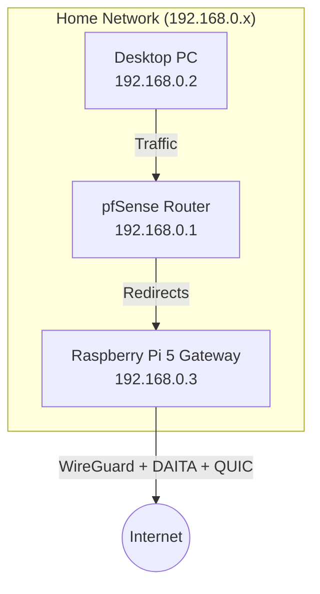

# Mullvad Hardened Gateway (DAITA + Quantum + QUIC) on Raspberry Pi 5

## 📖 Project Overview

I architected a solution where my **pfSense router** handles standard edge security but offloads VPN duties to a downstream **Raspberry Pi 5**. This is necessary because pfSense does not natively support Mullvad's newest **DAITA** (traffic pattern masking), **Quantum-Resistant** encryption, and **QUIC** obfuscation protocols.

The Pi acts as a hardened gateway, wrapping all traffic in these advanced layers. These heavy features originally caused interface crashes due to high handshake latency. To stabilize this, I engineered a custom bash script that enforces a "cold boot" service restart to ensure a clean bind and applies **CAKE** traffic shaping to sustain reliable **500Mbps** performance.

The result is a **self-healing network**: the system automatically detects connection drops, packet loss, or timeouts and seamlessly migrates routes to a healthy relay without any manual intervention.

### 🏆 Real-World Results

The results are impressive.

* **Speed:** Achieved **~300Mbps** downstream (server dependent) with **500Mbps** queue capacity.
* **Efficiency:** Raspberry Pi 5 CPU load stabilizes at only **~51%** under heavy load.
* **Stability:** This solution is significantly more stable than running OpenVPN or WireGuard directly on pfSense. The Mullvad daemon handles packet loss or timeouts by automatically migrating routes to a healthy relay.

## 🗺️ Network Layout



## ⚙️ Prerequisites

* **Hardware:** Raspberry Pi 5 (Preferred for Quantum performance; 4GB RAM recommended) or Pi 4.
* **OS:** Raspberry Pi OS Lite (64-bit).
* **Network:** Ethernet connection to your pfSense LAN.
* **Account:** A valid Mullvad VPN account number.

---

## 🚀 Step 1: Raspberry Pi 5 Setup

### 1. Install Dependencies & Mullvad

SSH into your Raspberry Pi (`192.168.0.3`) and run:

```bash
# Update System
sudo apt update && sudo apt full-upgrade -y

# Install Mullvad VPN App
sudo curl -fsSLo /usr/share/keyrings/mullvad-keyring.asc https://repository.mullvad.net/deb/mullvad-keyring.asc
echo "deb [signed-by=/usr/share/keyrings/mullvad-keyring.asc arch=$( dpkg --print-architecture )] https://repository.mullvad.net/deb/stable $(lsb_release -cs) main" | sudo tee /etc/apt/sources.list.d/mullvad.list
sudo apt update
sudo apt install mullvad-vpn -y

# Login
mullvad account login <YOUR_ACCOUNT_NUMBER>

```

### 2. Install the Hardened Gateway Script

This script handles the "Cold Boot" logic, enables the security stack (DAITA/QUIC/Quantum), and applies CAKE traffic shaping.

`sudo nano /usr/local/bin/mullvad-gateway.sh`

**Paste the following code (v17.1 Stable):**

```bash
#!/bin/bash
# ==============================================================================
#  MULLVAD HARDENED GATEWAY (v17.1)
#  - Features: DAITA + QUANTUM + QUIC (All Enabled)
#  - Fix: "Cold Boot" Restart Strategy to prevent handshake crashes
#  - Perf: CAKE QoS @ 500Mbit + MSS Clamping
# ==============================================================================

# 1. CLEANUP & PREP
pkill -f "mullvad_watchdog_process"
pkill -f "ping -c 1"
iptables -F
iptables -P FORWARD ACCEPT
echo "[$(date)] 🟢 Starting Gateway Sequence..."

# 2. OPTIMIZE NETWORK
ethtool --set-eee eth0 eee off > /dev/null 2>&1 || true
sysctl -w net.ipv4.ip_forward=1 > /dev/null

# 3. CONFIGURE MULLVAD
mullvad disconnect
# Enable Obfuscation (QUIC)
mullvad obfuscation set mode quic
mullvad relay set tunnel-protocol wireguard
mullvad relay set location nl
# Enable Advanced Security
mullvad tunnel set wireguard --quantum-resistant on
mullvad tunnel set wireguard --daita on
mullvad lan set allow

# 4. COLD BOOT (CRITICAL FIX)
# Restarts daemon to force a clean bind for heavy encryption layers
echo "🔄 Restarting Mullvad Service..."
systemctl restart mullvad-daemon
sleep 10

# 5. CONNECT & WAIT
echo "⏳ Connecting..."
mullvad connect

MAX_RETRIES=45
COUNT=0
NEW_WG_IF=""
while [ $COUNT -lt $MAX_RETRIES ]; do
    NEW_WG_IF=$(ip -br link show | grep -E 'wg[0-9]?-mullvad' | awk '{print $1}')
    if [ -n "$NEW_WG_IF" ]; then
        echo "✅ Interface Created: $NEW_WG_IF"
        break
    fi
    sleep 1
    ((COUNT++))
done

if [ -z "$NEW_WG_IF" ]; then
    echo "❌ CRITICAL: Handshake failed. Reverting to safe mode..."
    mullvad tunnel set wireguard --daita off
    mullvad connect
    exit 1
fi

# 6. ROUTING & FIREWALL
ip link set dev "$NEW_WG_IF" mtu 1280
iptables -t nat -A POSTROUTING -o "$NEW_WG_IF" -j MASQUERADE
iptables -t mangle -A FORWARD -p tcp --tcp-flags SYN,RST SYN -j TCPMSS --set-mss 1000

# 7. TRAFFIC CONTROL (CAKE - 500Mbit)
tc qdisc del dev eth0 root > /dev/null 2>&1
tc qdisc add dev eth0 root cake bandwidth 500mbit nat wash ack-filter

# 8. VERIFICATION
echo "⏳ Waiting for connectivity..."
sleep 5
STATUS=$(mullvad status | head -n 1)
IP=$(curl -s --connect-timeout 5 https://am.i.mullvad.net/ip || echo "Unknown")

echo "================ STATUS REPORT ================"
echo "STATUS:      $STATUS"
echo "PUBLIC IP:   $IP"
echo "OBFUSCATION: $(mullvad obfuscation get | awk '{print $2}')"
echo "DAITA/PQC:   Active"
echo "==============================================="

```

### 3. Make it Executable & Run

```bash
sudo chmod +x /usr/local/bin/mullvad-gateway.sh
sudo bash /usr/local/bin/mullvad-gateway.sh

```

---

## 🛡️ Step 2: pfSense Router Settings

Since pfSense cannot handle these encryption protocols natively, we will route your Desktop's traffic **through** the Pi.

**Network Map:**

* **pfSense Router:** `192.168.0.1`
* **Desktop PC:** `192.168.0.2`
* **Raspberry Pi 5:** `192.168.0.3`

### 1. Set a Static IP for the Pi

* Go to **Services > DHCP Server**.
* Find your Raspberry Pi's MAC address.
* Assign it the Static IP: `192.168.0.3`.

### 2. Create the Gateway

* Go to **System > Routing > Gateways**.
* Click **Add**.
* **Interface:** LAN
* **Address Family:** IPv4
* **Name:** `PI_VPN_GW`
* **Gateway:** `192.168.0.3` (The Pi's IP)
* **Monitor IP:** `1.1.1.1`


* Click **Save** and **Apply**.

### 3. Route Traffic to the Pi

* Go to **Firewall > Rules > LAN**.
* Click **Add** (Top of the list).
* **Action:** Pass
* **Protocol:** Any
* **Source:** Single Host or Alias -> `192.168.0.2` (Your Desktop IP).
* **Destination:** Any
* **Advanced Options (Show Advanced):** Scroll down to **Gateway**.
* **Gateway:** Select `PI_VPN_GW`.


* Click **Save** and **Apply**.

---

## ✅ Verification & Logs

On the Raspberry Pi, run the following to view the status and CAKE traffic stats:

```bash
tail -f /var/log/mullvad-optimizer.log

```

**Expected Output:**

```text
✅ Interface Created: wg0-mullvad
✅ Connection Established!
PUBLIC IP: 193.x.x.x
Obfuscation: quic (QUIC)
MSS CLAMP: 1000 (Safe)
QUEUE ALG: CAKE (500mbit)

```

**Note on Stability:**
You may occasionally see `⚠️ Connection Drop Detected` in the logs. This is normal behavior when Mullvad is automatically rotating relays or if a specific server times out. The system is designed to self-heal and maintain the connection seamlessly.
